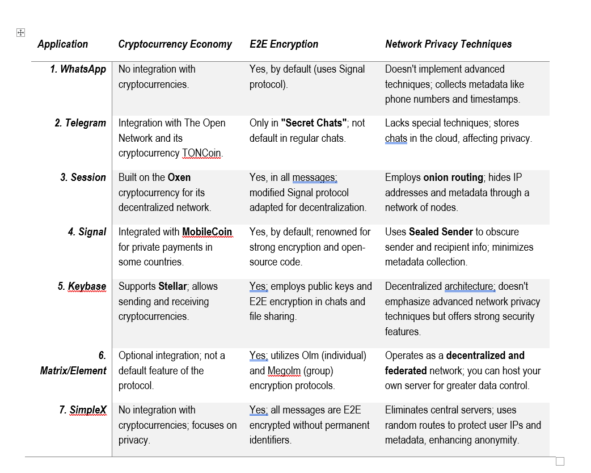

# Slide One: Problem Statement

## Our environment is designed for miscommunication.

   * We think we're thinkers, but we're feelers.  We act on emotion.  We pay attention to that which is outrageous, and the costs of those payments are mounting into insurmountable emotional debt.

   * We are outraged because it's attention grabbing, maybe more attention grabbing than anything else.

   * Any digital communication that leaks information is monetizeable as behavioral data.
##

# Slide Two: Attention Economics

## In 2017 Face Book content presentation algorithms were directed to maximize engagement

   * The most effective way to maximize engagement was to stimulate outrage in viewers.  This was accomplished by spreading hate speech
   * This resulted in the genocide and ethnic cleansing of the Rohinga muslim minority in Myanmar.

Hypothesis:  All non-private/leaked data is monetizeable.

Argument:

  [A] All observable data about a person can contribute to a computational model of a person.

  [B] The more accurate the model, the better information it provides for manipulating the person.

  [C] Manipulating people is profitable.
  
  [D] Therefore, observable data is valuable.
  
  [E] Outrage increases observable data.
  
  [F] Therefore, outrage creates value. 

Making data private prevents [A].
##

# Slide Three: Problem Scale

## Vast

   * this isn't a cryptocurrency scoped issue
   * this is a problem that's on the scale of environmental concerns, war, pandemics, genocide.   It is, in a real sense "existential" for our species. 

  That's as big a problem as there is... but there's an exciting corollary..  the bigger the problem..  the more significant the solution!
##

# Slide Four:  What solutions already exist?

This is diversification of utility for Zcash.   Cryptocurrency markets are volatile, and are somewhat decoupled from messaging markets.

It also means we're going to charge a fee that goes, not to Zingo Labs...  but to Chaqui R&D and enhancement.
Now

In other words, we aim to **catalyze** the diversification of Zcash **beyond** mere cryptocurrency...    not to build it all by ourselves, but to expose the fantastic technologies that others have already built..   to the world!

